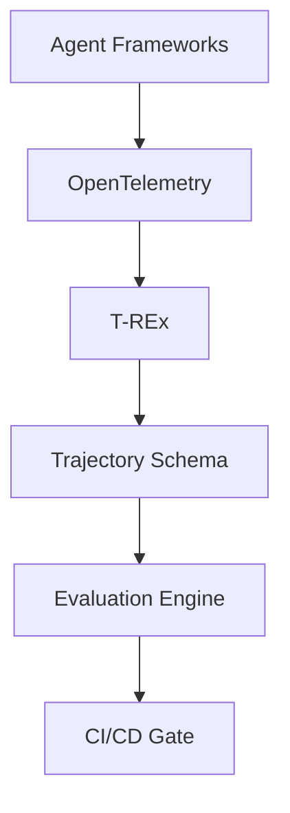
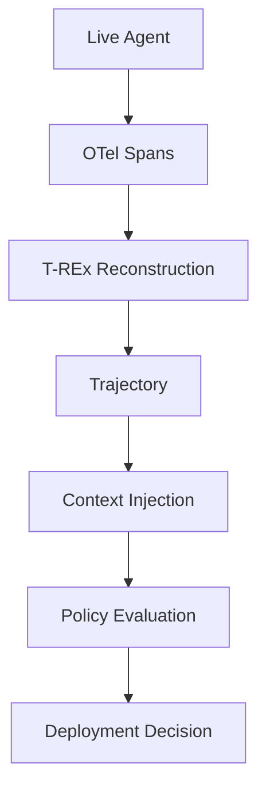

# Telefix-Agent-Eval

Telefix-Agent-Eval is an OpenTelemetry-compatible reliability platform that reconstructs AI agent trajectories, evaluates context-aware safety policies, detects lexical drift, and blocks unsafe releases through deterministic CI/CD gates.

## Architecture Diagram



Mermaid source: [assets/architecture.mmd](assets/architecture.mmd)

## Problem Statement

Operational AI agents can choose tools, loop, mutate state, lose context, and escalate from degraded reasoning. Traditional observability helps answer what happened after execution. Telefix-Agent-Eval answers the release question before deployment: should this agent version be trusted in production?

The project turns raw OpenTelemetry traces into a canonical trajectory, applies deterministic safety and reliability checks, and returns a deployment decision that can fail a pull request or release pipeline.

## Core Capabilities

- Live LangGraph agent execution with mock telecom infrastructure.
- OpenTelemetry span capture and async SQLite trace persistence.
- T-REx trajectory reconstruction for out-of-order and cyclic workflows.
- Framework-agnostic canonical trajectory JSON Schema and Pydantic models.
- Deterministic evaluation for unsafe tools, loops, escalation, cost, latency, and tool selection.
- Context-aware policy rules with runtime context injection.
- Lexical state-drift analysis for repeated reasoning, objective loss, and context growth.
- CLI and GitHub Action release gates for CI/CD.

## End-to-End Workflow



Mermaid source: [assets/evaluation-flow.mmd](assets/evaluation-flow.mmd)

## Quick Start

Python 3.12 is recommended.

```bash
python -m venv .venv
```

PowerShell:

```powershell
.\.venv\Scripts\Activate.ps1
python -m pip install --upgrade pip
pip install -e ".[dev]"
```

macOS/Linux:

```bash
source .venv/bin/activate
python -m pip install --upgrade pip
pip install -e ".[dev]"
```

Run the live LangGraph demo:

```bash
python examples/langgraph/scenarios.py
```

Expected output:

```text
PASS: High latency incident

FAIL: Unsafe tool selected: restart_gateway

FAIL: Loop threshold exceeded
```

## Example CLI Commands

Evaluate a failing trajectory:

```bash
telefix evaluate \
  examples/telecom/tool_misfire/expected_trajectory.json \
  --policy examples/telecom/tool_misfire/policy.yaml
```

Evaluate with runtime context injection:

```bash
telefix evaluate \
  examples/telecom/tool_misfire/expected_trajectory.json \
  --policy examples/telecom/tool_misfire/policy.yaml \
  --context context.json
```

Write a machine-readable CI report:

```bash
telefix evaluate \
  examples/telecom/high_latency/expected_trajectory.json \
  --policy examples/telecom/high_latency/policy.yaml \
  --json-output telefix-report.json
```

## Benchmark Table

| Scenario | Decision | Policy Violation |
| --- | --- | --- |
| High Latency | PASS | None |
| Tool Misfire | FAIL | Unsafe restart_gateway |
| BGP Route Flap | FAIL | Loop threshold exceeded |

See [docs/benchmarks.md](docs/benchmarks.md) for the scenario summary.

## Repository Structure

```text
assets/                  Mermaid diagram sources
docs/                    Architecture, schema, evaluator, CLI, and integration docs
examples/langgraph/      Live LangGraph + OpenTelemetry reference integration
examples/telecom/        Synthetic incident fixtures and expected reports
schemas/                 Canonical trajectory JSON Schema
scripts/                 End-to-end demo runner
telefix/cli/             CLI release gate
telefix/evaluator/       Deterministic metrics, policies, drift analysis
telefix/otel/            Background OpenTelemetry exporter
telefix/storage/         Async SQLite trace store
telefix/trex/            Trajectory Reconstruction Engine
tests/                   Unit and integration coverage
```

## Documentation Links

- [Architecture](docs/architecture.md)
- [Benchmarks](docs/benchmarks.md)
- [Canonical trajectory schema](docs/trajectory-schema.md)
- [T-REx reconstruction engine](docs/trex.md)
- [Evaluation engine](docs/evaluation-engine.md)
- [Context-aware policies](docs/context-aware-policies.md)
- [Runtime context injection](docs/runtime-context.md)
- [State-drift analysis](docs/state-drift.md)
- [CI/CD gate CLI](docs/ci-gate.md)
- [GitHub Action](docs/github-action.md)
- [Live LangGraph integration](docs/langgraph-integration.md)
- [SQLite trace store](docs/sqlite-store.md)

## Roadmap

- Add framework adapters for more agent runtimes while keeping the canonical schema stable.
- Publish packaged GitHub Action examples for external repositories.
- Add richer fixture generation for multi-agent and human-approval workflows.
- Expand benchmark scenarios across incident domains beyond telecom.

## License

MIT. Synthetic examples only; no customer data, credentials, proprietary manuals, or production network interfaces are included.
