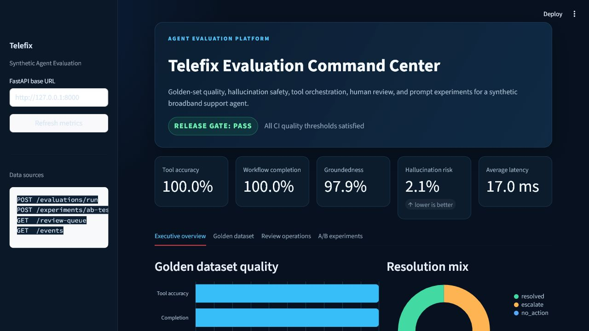
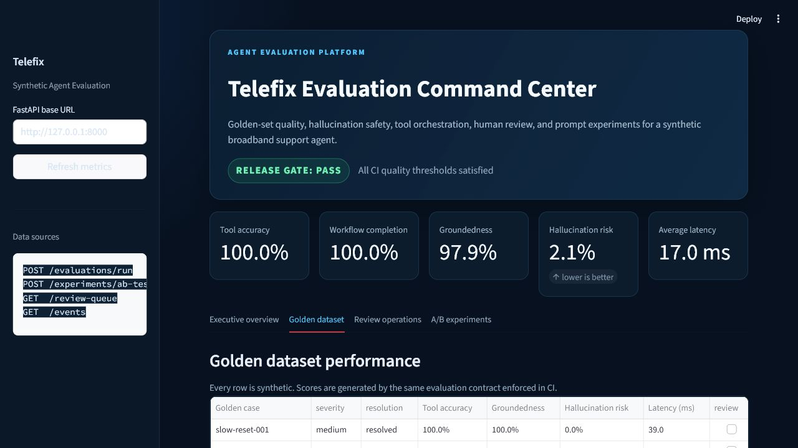
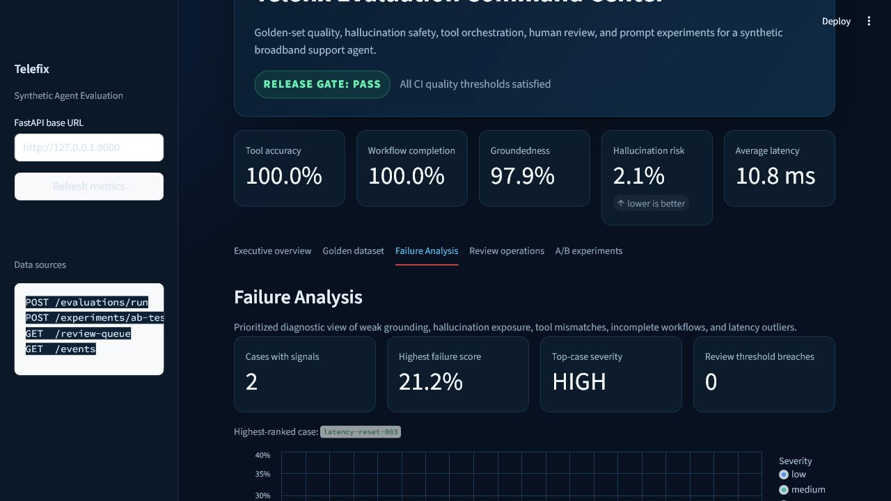
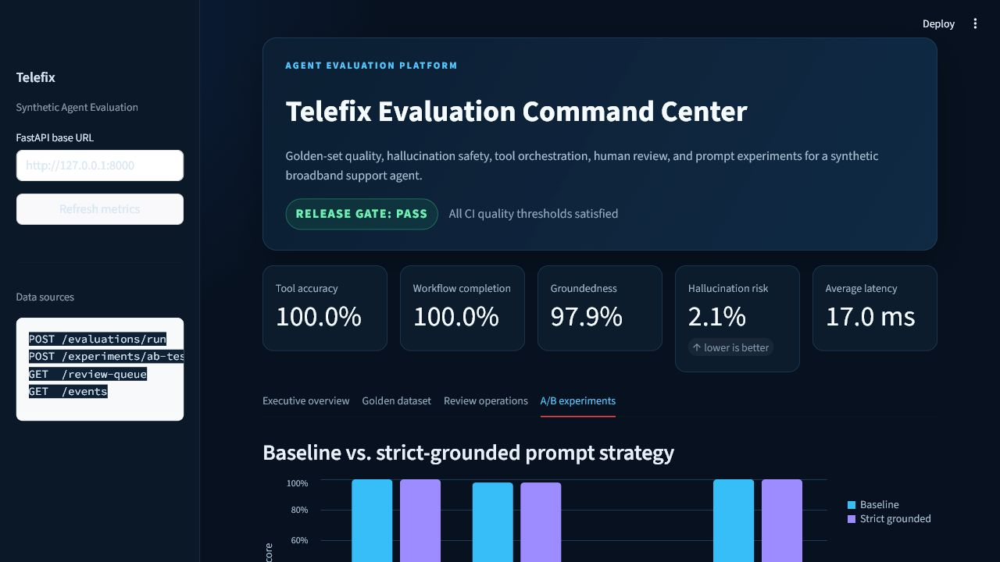

# Telefix Agent Evaluation

 FastAPI and LangGraph demo for evaluating a broadband
troubleshooting agent. The project resembles the workflow an agent might use in a
large cable provider environment while using only synthetic manuals, deterministic
mock telemetry, and a mock RF reset.


## What It Demonstrates

- A typed `POST /api/v1/diagnose` API
- A LangGraph workflow with retrieval, telemetry, action, verification, and evaluation
- Explicit customer consent before a mock reset
- Local synthetic RAG by default, with a Qdrant-compatible adapter
- Evaluation scores for tool selection, groundedness, hallucination risk, and completion
- A Streamlit command center for evaluation quality, safety, review, and experiments
- Regression tests for workflow structure and unsupported-claim controls

## Architecture

The graph retrieves relevant synthetic guidance, reads mock modem telemetry, and
chooses one of three policy outcomes:

1. A degraded modem with consent receives a mock reset and verification read.
2. An offline modem is escalated without pretending that a remote fix succeeded.
3. Healthy telemetry produces a no-action result and continued symptom isolation.

The final graph node scores the run and includes the tool trace, expected tools,
citations, and unsupported claims in the response. See
[`docs/architecture.md`](docs/architecture.md) for the detailed flow.

## Setup

Python 3.11 or newer is required.

```bash
python -m venv .venv
```

PowerShell:

```powershell
.\.venv\Scripts\Activate.ps1
python -m pip install --upgrade pip
pip install -e ".[dev,dashboard]"
Copy-Item .env.example .env
uvicorn src.main:app --reload
```

macOS/Linux:

```bash
source .venv/bin/activate
python -m pip install --upgrade pip
pip install -e ".[dev,dashboard]"
cp .env.example .env
uvicorn src.main:app --reload
```

OpenAPI documentation is available at `http://127.0.0.1:8000/docs`.

## Visual Demo

The Streamlit command center presents the evaluation platform as an operational
product rather than a collection of JSON endpoints. It loads live metrics from
FastAPI and highlights the CI release gate, golden dataset quality, hallucination
trends, tool accuracy, workflow completion, prioritized failure analysis, human
review workload, and prompt A/B results.









Launch the API:

```bash
uvicorn src.main:app --reload
```

Launch the dashboard in a second terminal:

```bash
streamlit run dashboard/app.py
```

The dashboard opens at `http://127.0.0.1:8501`. To point it at another API:

```bash
TELEFIX_API_URL=http://127.0.0.1:8000 streamlit run dashboard/app.py
```

## Curl Demo

```bash
curl -X POST http://127.0.0.1:8000/api/v1/diagnose \
  -H "Content-Type: application/json" \
  -d '{
    "account_id": "demo-1001",
    "symptoms": "Internet is slow and drops every few minutes.",
    "consent_to_reset": true
  }'
```

The response includes pre- and post-reset telemetry, synthetic citations, the
workflow trace, and deterministic evaluation metrics.

## Run Tests

```bash
pytest
ruff check .
```

## Qdrant Mode

Local retrieval is the zero-infrastructure default. To use Qdrant, populate a
collection with synthetic documents whose payload contains `document_id`, `title`,
`text`, and `tags`, then set:

```dotenv
TELEFIX_RAG_BACKEND=qdrant
TELEFIX_QDRANT_URL=http://localhost:6333
TELEFIX_QDRANT_COLLECTION=synthetic_broadband_manuals
```

The adapter intentionally filters by synthetic document tags. Embedding generation
and ingestion are deployment concerns and are not required for the local demo.

## Agent Evaluation Interview Demo

This repository is designed to support an Agent Evaluation interview discussion
without using real Comcast systems or proprietary data.

- **FastAPI gateway:** exposes diagnosis, batch evaluation, review queue, and A/B
  experiment endpoints with typed request and response contracts.
- **LangGraph workflow:** makes retrieval, telemetry inspection, consent-gated action,
  verification, response composition, and scoring explicit state transitions.
- **RAG grounding:** uses synthetic broadband manuals locally by default and includes
  a Qdrant-compatible adapter for a production-style retrieval architecture.
- **Golden dataset:** `evals/golden_cases.json` contains synthetic scenarios with
  expected tools, outcomes, grounding documents, and severity labels.
- **LLM/heuristic metrics:** deterministic heuristics score tool selection, workflow
  completion, grounding coverage, hallucination risk, and latency. A production
  version can add an LLM judge while preserving the same result contract.
- **Human-in-the-loop queue:** cases with hallucination risk above `0.35` or
  groundedness below `0.75` are routed to a process-local mock review queue.
- **A/B prompt testing:** compares `baseline` and `strict_grounded` strategies over
  the same golden cases and reports metric deltas.
- **CI/CD regression gate:** `tests/test_eval_regression_gate.py` fails when quality
  metrics fall below the checked-in acceptance thresholds.

Run the full verification suite:

```bash
pytest
ruff check .
uvicorn src.main:app --reload
```

Diagnose one synthetic case:

```bash
curl -X POST http://127.0.0.1:8000/api/v1/diagnose \
  -H "Content-Type: application/json" \
  -d '{
    "account_id": "demo-1001",
    "symptoms": "Internet is slow and drops every few minutes.",
    "consent_to_reset": true
  }'
```

Run the golden evaluation suite:

```bash
curl -X POST http://127.0.0.1:8000/api/v1/evaluations/run
```

Compare prompt strategies:

```bash
curl -X POST http://127.0.0.1:8000/api/v1/experiments/ab-test
```

Inspect cases routed for human review:

```bash
curl http://127.0.0.1:8000/api/v1/review-queue
```

## Enterprise Scale Walkthrough

For an enterprise Agent Evaluation discussion, the project separates the customer
interaction path from quality analysis:

- The **live path is latency-sensitive**. `/api/v1/diagnose` runs only the required
  LangGraph troubleshooting steps, stores the session, and emits a compact trace.
- **Evaluations are out-of-band**. Events are consumed by the offline worker through
  `/api/v1/evaluations/process-events`, so scoring does not add live-path latency.
- **State is decoupled from compute** through `DiagnosticStateStore`. Local runs use
  memory; horizontally scaled deployments can select Redis with configuration.
- **LLM provider failures are isolated** through retry, fallback, circuit breaking,
  and provider-level success, failure, fallback, and latency metrics.
- **Retrieval uses hybrid ranking**: BM25-style lexical search, deterministic semantic
  matching, reciprocal rank fusion, and a reranking stage.
- **Regressions are blocked in CI** by golden-dataset thresholds for tools,
  completion, grounding, and hallucination risk.

Configuration for distributed session state:

```dotenv
TELEFIX_STATE_BACKEND=memory
TELEFIX_REDIS_URL=redis://localhost:6379/0
```

Run and verify:

```bash
pytest
ruff check .
uvicorn src.main:app --reload
```

Create a diagnostic session:

```bash
curl -X POST http://127.0.0.1:8000/api/v1/diagnose \
  -H "Content-Type: application/json" \
  -d '{
    "account_id": "enterprise-demo-1001",
    "symptoms": "Internet is slow and intermittent.",
    "consent_to_reset": true
  }'
```

Look up the returned session ID:

```bash
curl http://127.0.0.1:8000/api/v1/sessions/REPLACE_WITH_SESSION_ID
```

Run the golden regression evaluation:

```bash
curl -X POST http://127.0.0.1:8000/api/v1/evaluations/run
```

Process pending live-path evaluation events:

```bash
curl -X POST http://127.0.0.1:8000/api/v1/evaluations/process-events
```

Run the prompt A/B experiment:

```bash
curl -X POST http://127.0.0.1:8000/api/v1/experiments/ab-test
```

