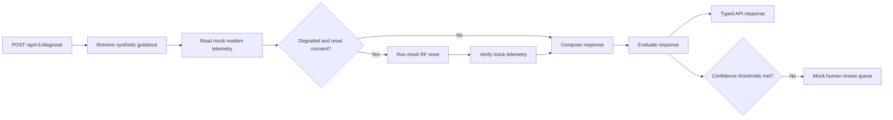

# Telefix Agent Evaluation Architecture

## Purpose

Telefix is a synthetic, Comcast-style interview demonstration. It models the shape
of a broadband support agent without using customer records, production network
access, or proprietary operational manuals.

## Request Flow



## Components

- `src/main.py`: FastAPI application and dependency lifecycle.
- `src/agent.py`: LangGraph state machine, deterministic policy, and evaluation.
- `src/tools.py`: Synthetic telemetry and reset tools.
- `src/rag.py`: Local lexical retrieval and a Qdrant-compatible adapter.
- `src/schemas.py`: Pydantic request, response, telemetry, citation, and metric models.
- `src/config.py`: Environment-driven configuration.
- `src/evaluation.py`: Golden dataset loading, case execution, and aggregate metrics.
- `src/experiments.py`: Baseline and strict-grounded prompt strategy comparison.
- `src/review_queue.py`: Threshold-based process-local human review queue.
- `dashboard/app.py`: Streamlit command center backed by the evaluation APIs.
- `dashboard/client.py`: Typed dashboard API client and presentation transforms.

## Safety and Grounding

The graph never connects to real network equipment. Reset execution requires
explicit consent and only updates an in-memory workflow state. Customer identifiers
are used solely to derive a stable synthetic modem ID.

Responses are intentionally templated from observed telemetry states. Retrieved
documents are returned as citations, and the evaluation layer flags missing support.
The offline path escalates instead of inventing an outage or claiming a repair.

## Evaluation Model

- **Tool selection** compares the ordered tool trace with the expected policy.
- **Groundedness** verifies that retrieved synthetic guidance supports the response.
- **Hallucination risk** is the inverse of groundedness and includes unsupported claims.
- **Workflow completion** checks that the graph reaches a terminal decision with an action.

These metrics are deliberately transparent and deterministic. A production system
could augment them with model-based judges, labeled datasets, and trace analytics.

The CI regression gate enforces minimum aggregate quality on every test run. The
same runner powers the evaluation API and A/B experiment API, avoiding drift between
offline testing and the interview demonstration.

## Production Evolution

For a real deployment, replace the mock tools with authenticated service clients,
store traces with enterprise redaction and retention controls, seed Qdrant with
approved documents and embeddings, and require human approval for impactful actions.
The included Redis, event-stream, LLM resiliency, and hybrid retrieval interfaces
show where those managed integrations attach.

## Production-Grade Enterprise Architecture

The local adapters model production boundaries without requiring external
infrastructure. `DiagnosticStateStore` can move from process memory to Redis,
`EvaluationEventStream` can move to Kafka or Kinesis, and the local retriever can
move to an approved vector store without changing the live API contract.

```text
                           +-----------------------------+
 Customer / Agent Desktop | API Gateway                 |
 ------------------------>| JWT validation              |
                           | tenant policy + rate limits |
                           +--------------+--------------+
                                          |
                           +--------------v--------------+
                           | Kubernetes FastAPI Pods     |
                           | HPA on CPU, latency, queue   |
                           +---+-----------+----------+--+
                               |           |          |
                    session    |           |          | provider call
                    state      |           |          v
                               v           |   +----------------------+
                    +------------------+   |   | LLM Router           |
                    | Redis / Postgres |   |   | retry + fallback     |
                    | external state   |   |   | circuit breaker      |
                    +------------------+   |   +----------------------+
                                           |
                         trace event       | hybrid retrieval
                               +-----------+----------+
                               v                      v
                    +------------------+    +------------------------+
                    | Kafka / Kinesis  |    | Hybrid RAG             |
                    | evaluation topic |    | BM25 + dense simulation|
                    +--------+---------+    | RRF + reranking        |
                             |              +------------------------+
                             v
                    +----------------------+
                    | Evaluation Workers   |
                    | groundedness / risk  |
                    | tool + completion    |
                    +----------+-----------+
                               |
                 +-------------+-------------+
                 v                           v
        +------------------+       +----------------------+
        | Metrics / CI gate|       | Human Review Queue   |
        | release blocking |       | low-confidence cases |
        +------------------+       +----------------------+
```

### Live Path

The live diagnose path is intentionally small: validate input, resume or create
externalized session state, run the LangGraph policy, return the response, and
publish a trace event as a background task. Golden-dataset and event-quality
evaluation do not block the customer-facing request.

### State and Compute

FastAPI pods are stateless compute. Redis supports low-latency session continuation;
Postgres would be appropriate for durable audit records and reporting. Kubernetes
HPA can scale pods independently from the state tier.

### Resilient Model Access

`LLMRouter` retries rate-limit and server failures with exponential backoff. Repeated
primary failures open a circuit and isolate that provider while requests use the
fallback. Provider success, fallback, failure, and latency metrics are observable.

### Retrieval and Evaluation

Local hybrid retrieval combines BM25-style lexical ranking with deterministic
semantic concepts, applies reciprocal rank fusion, and reranks the fused candidates.
The same shape can front managed dense retrieval in production.

Kafka or Kinesis decouples trace production from the offline worker pool. Workers
score grounding, hallucination risk, tool selection, and completion, then route
low-quality cases to human review. CI/CD regression gates run the checked-in golden
dataset before deployment and block releases that fall below quality thresholds.
