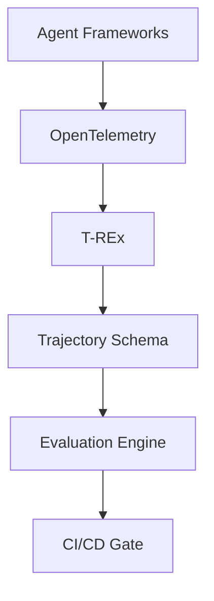
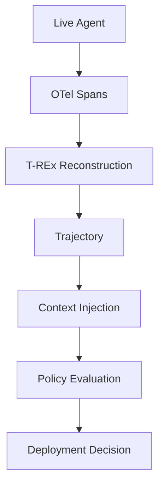

# Architecture

Telefix-Agent-Eval is organized around a strict boundary: only the reconstruction layer understands telemetry internals. Everything after reconstruction consumes a canonical `Trajectory`.

## Top-Level Flow

## Evaluation Flow

## Components

- `examples/langgraph/`: live LangGraph incident-response workflow with mock telecom tools and OpenTelemetry spans.
- `telefix/otel/`: background OpenTelemetry exporter that decouples span persistence from agent execution.
- `telefix/storage/`: async SQLite trace store for raw spans.
- `telefix/trex/`: T-REx reconstruction engine that converts raw spans into canonical trajectories.
- `telefix/models/trajectory.py`: Pydantic v2 canonical trajectory contract.
- `schemas/trajectory_schema.json`: versioned JSON Schema for the canonical trajectory.
- `telefix/evaluator/`: deterministic metrics, context-aware policies, runtime context handling, and lexical drift analysis.
- `telefix/cli/`: `telefix evaluate` release gate.
- `.github/actions/evaluate/`: reusable GitHub Action wrapper around the CLI.

## Design Principles

- **Framework agnostic after ingestion**: LangGraph, OpenAI Agents SDK, CrewAI, and custom runtimes normalize into the same trajectory shape.
- **Deterministic release decisions**: no LLM judges, model downloads, external APIs, or probabilistic scoring are required for CI.
- **Policy context is explicit**: runtime context can be injected at evaluation time and overrides trajectory-provided context.
- **Telemetry is decoupled**: the SQLite exporter buffers spans so agent execution does not block on persistence.
- **Schema first**: downstream services depend on canonical trajectories, not OpenTelemetry internals.

## Safety Boundary

The repository uses synthetic incidents, synthetic telemetry, and mock tools. It does not include customer data, credentials, proprietary runbooks, or production network access.
